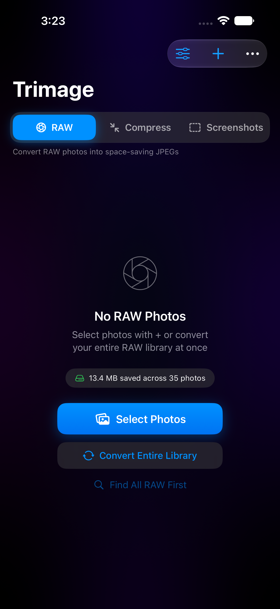
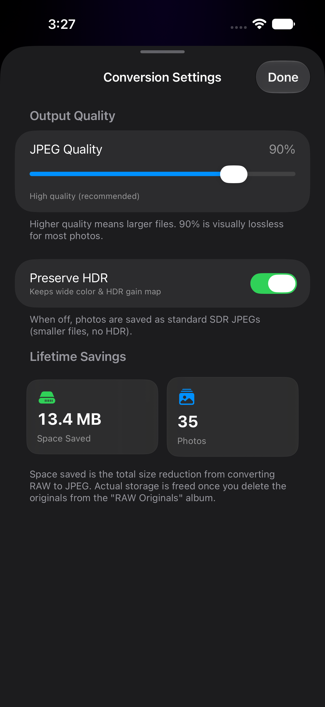

# Trimage — RAW & JPEG Compressor

**Reclaim storage on your iPhone by converting space-hungry RAW photos, large
JPEGs, and screenshots into smaller JPEGs — entirely on-device, with your
originals kept safe until you choose to delete them.**

Trimage is a native iOS app built with SwiftUI. It finds the photos taking up
the most space, converts them to efficient JPEGs while preserving metadata
(and optionally HDR), and gathers the originals into an album so you can review
and delete them yourself in the Photos app.

<p align="center">
  
  &nbsp;&nbsp;
  
</p>

> Screenshots are captured in the iOS Simulator using Apple's sample images — no
> personal photos are shown.

## Features

- **Three cleanup modes**
  - **RAW → JPEG** — convert RAW/DNG photos into space-saving JPEGs.
  - **Compress** — recompress large JPEG, PNG, TIFF, BMP, and GIF images.
    (HEIC is intentionally left untouched — converting it to JPEG would
    *increase* the file size.)
  - **Screenshots** — shrink space-hungry screenshots (usually large PNGs).
- **Your originals stay safe.** Nothing is deleted automatically. Converted
  originals are gathered into an album ("RAW Originals", "Compressed Originals",
  or "Screenshot Originals") so you can review and delete them on your own terms.
- **Quality control.** Adjustable JPEG quality (90% is visually lossless for
  most photos).
- **HDR aware.** Optionally preserve wide color and the HDR gain map, or save
  smaller standard SDR JPEGs.
- **Smart size presets.** Scope scans to **Small / Medium / Large** photos so
  you target the files that actually save space.
- **Lifetime savings.** A running tally of total space saved and photos
  converted.
- **Metadata preserved.** Creation date, location, and favorite status carry
  over to the converted copy.
- **100% on-device & private.** No accounts, no analytics, no uploads.

## How it works

1. Pick a mode (RAW, Compress, or Screenshots).
2. **Select Photos** with the `+` button, or scan your whole library
   (e.g. *Find All RAW*, *Find Large JPEGs*, *Find Screenshots*).
3. Optionally narrow the list by date.
4. Tap **Convert**. Trimage creates optimized JPEG copies in your library.
5. When done, choose **Move to Album** to gather the originals for review — then
   delete them from the Photos app whenever you're ready. Storage is reclaimed
   at that point.

Only the relevant files are processed in each mode. In Compress mode, HEIC
photos and images below your chosen size threshold are skipped; if a manual
selection adds nothing, Trimage explains why (for example, "these photos are
already HEIC").

## Requirements

- iOS 18.0 or later
- Xcode 16 or later (Swift / SwiftUI)

## Build & run

```bash
git clone git@github.com:modikush80/Trimage.git
cd Trimage
open RAW2JPEG.xcodeproj
```

Then select an iPhone simulator (or your device) and run. On first launch the
app requests photo-library access — choose **Full Access** so it can find
photos, save converted copies, and organize originals into an album.

Command-line build for the simulator:

```bash
xcodebuild -project RAW2JPEG.xcodeproj -scheme RAW2JPEG \
  -sdk iphonesimulator -destination 'generic/platform=iOS Simulator' build
```

## Project structure

```
RAW2JPEG/
├── RAW2JPEG/
│   ├── RAW2JPEGApp.swift            # App entry point
│   ├── Models/
│   │   └── ConversionModels.swift   # ConversionResult, AssetInfo
│   ├── Services/
│   │   └── RawConverter.swift       # Asset matching + on-device conversion
│   ├── State/
│   │   └── AppState.swift           # Observable app state & workflows
│   ├── Views/
│   │   ├── ContentView.swift            # Root screen & toolbar
│   │   ├── ContentView+Sections.swift   # Mode picker, photo list, bottom bar
│   │   ├── ContentView+Settings.swift   # Settings & date sheets
│   │   └── Components/                   # GlassChip, ModeSelector, Thumbnail
│   └── Assets.xcassets
├── tools/                           # Icon generation helper
├── docs/screenshots/                # README screenshots (no personal data)
├── PRIVACY.md
└── SUPPORT.md
```

## Privacy

Trimage processes everything **on your device**. It does not collect, upload, or
share your photos or any personal data. See [PRIVACY.md](PRIVACY.md) for details.

## Support

Questions or issues? See [SUPPORT.md](SUPPORT.md) or email **modikush80@gmail.com**.

## License

© 2026 Kush Modi. All rights reserved.
